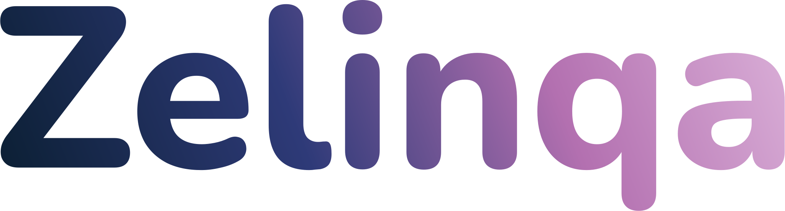
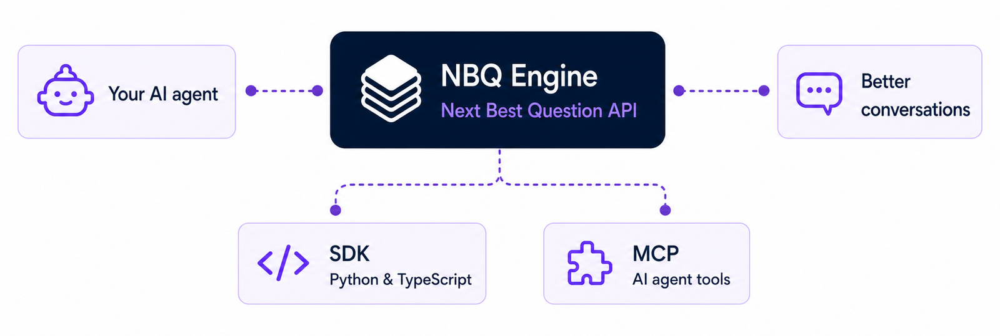

  

  <h2>The Questioning Intelligence Layer for AI</h2>

  
<strong>AI knows how to answer. We help it know what to ask next.</strong>

  

    Zelinqa gives AI agents the intelligence to select the next best question,
    understand conversational progress, and guide every exchange toward a goal.
  

 

  

  Goal-driven question selection, contextual progression, and conversation
  outcomes — exposed through one API.

<strong>Start building</strong>

<table>
  <tr>
    <td align="center" width="33%">
      <strong>Python SDK</strong>  
      <code>pip install nbq</code>  
      <a href="https://pypi.org/project/nbq/">PyPI</a>
      &nbsp;·&nbsp;
      <a href="https://github.com/Zelinqa/nbq-sdk">Source</a>
    </td>
    <td align="center" width="33%">
      <strong>TypeScript SDK</strong>  
      <code>pnpm add @zelinqa/nbq</code>  
      <a href="https://www.npmjs.com/package/@zelinqa/nbq">npm</a>
      &nbsp;·&nbsp;
      <a href="https://github.com/Zelinqa/nbq-sdk">Source</a>
    </td>
    <td align="center" width="33%">
      <strong>MCP</strong>  
      <strong>Official MCP Server</strong>  
      <a href="https://github.com/Zelinqa/nbq-mcp"><code>nbq-mcp</code></a>
    </td>
  </tr>
</table>

  <a href="https://docs.zelinqa.ai"><strong>Documentation</strong></a>
  &nbsp;&nbsp;·&nbsp;&nbsp;
  <a href="https://zelinqa.ai"><strong>Website</strong></a>
  &nbsp;&nbsp;·&nbsp;&nbsp;
  <a href="mailto:contact@zelinqa.ai"><strong>Contact</strong></a>

---

  
    The NBQ SDK and MCP server are open source. The hosted NBQ Engine, scoring
    algorithm, prompts, and infrastructure remain private.
  

