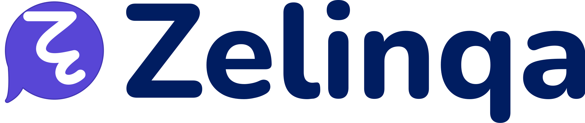
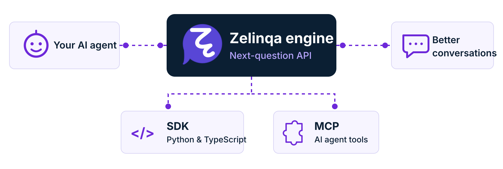

  <a href="https://zelinqa.ai">
    <picture>
      <source media="(prefers-color-scheme: dark)" srcset="./assets/zelinqa-logo-light.svg" />
      
    </picture>
  </a>

  <h2>The Questioning Intelligence Layer for AI</h2>

  
<strong>AI knows how to answer. We help it know what to ask next.</strong>

  

    Zelinqa gives AI agents the intelligence to select the next best question,
    understand conversational progress, and guide every exchange toward a goal.
  

 

  

  Goal-driven question selection, contextual progression, and conversation
  outcomes — exposed through one API.

<strong>Start building</strong>

<!--
  GitHub force les tableaux en `display: block; width: max-content` : les
  attributs width (%, 100%) sont ignorés, seule la largeur du CONTENU compte.
  L'espaceur transparent de 290 px en fin de cellule est donc ce qui fixe des
  colonnes égales et un tableau pleine largeur. `valign="top"` + une structure
  identique dans les trois cellules alignent badges, commandes et liens.
-->
<table>
  <tr>
    <td align="center" valign="top" width="33%">
        
        
      <a href="https://pypi.org/project/zelinqa/">PyPI</a>
      &nbsp;·&nbsp;
      <a href="https://github.com/Zelinqa/zelinqa-sdk">Source</a>
       
      
    </td>
    <td align="center" valign="top" width="33%">
        
        
      <a href="https://www.npmjs.com/package/@zelinqa/sdk">npm</a>
      &nbsp;·&nbsp;
      <a href="https://github.com/Zelinqa/zelinqa-sdk">Source</a>
       
      
    </td>
    <td align="center" valign="top" width="33%">
        
        
      <a href="https://pypi.org/project/zelinqa-mcp/">PyPI</a>
      &nbsp;·&nbsp;
      <a href="https://github.com/Zelinqa/zelinqa-mcp">Source</a>
       
      
    </td>
  </tr>
</table>

  <a href="https://docs.zelinqa.ai"><strong>Documentation</strong></a>
  &nbsp;&nbsp;·&nbsp;&nbsp;
  <a href="https://zelinqa.ai"><strong>Website</strong></a>
  &nbsp;&nbsp;·&nbsp;&nbsp;
  <a href="mailto:contact@zelinqa.ai"><strong>Contact</strong></a>

---

  
    The Zelinqa SDKs and MCP server are open source. The hosted Zelinqa engine, scoring
    algorithm, prompts, and infrastructure remain private.
  

